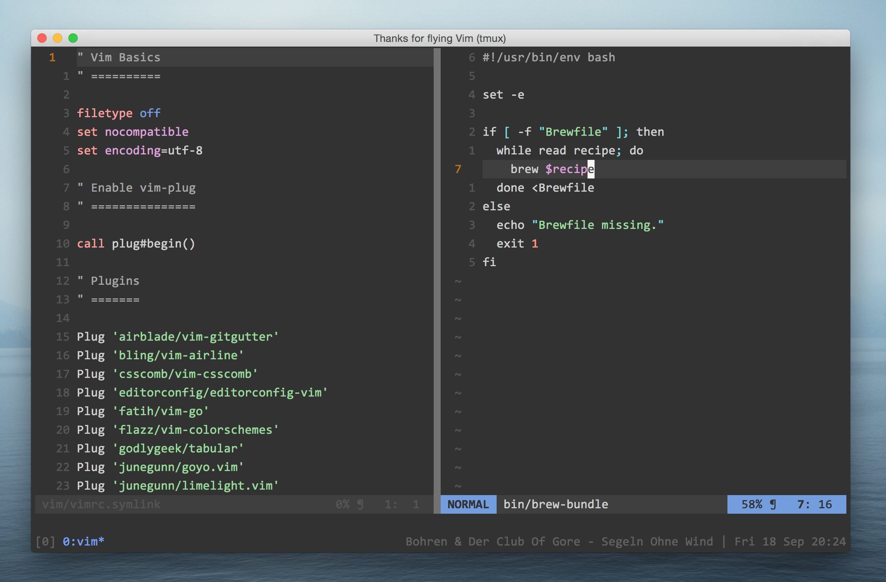

# Dotfiles

  My OSX configuration files. Please feel free to fork! :)

## Preview

  

## Usage

```bash
$ git clone https://github.com/marcusandre/dotfiles.git ~/.dotfiles
$ cd .dotfiles && make
```

## Parts

### Abstraction

```bash
$ make       # update, symlinks, vim, tmux
$ make setup # update repo, symlink files
$ make vim   # install vim files and plugins
$ make tmux  # install tmux files and plugins
```

### Scripts

  There are a bunch of scripts you can find in the `script` directory. They are
  used to setup the rest of the bits and pieces to get the installation right.

  * **setup** - dotfiles handling (basically `make setup`)
  * **vim** - setup vim and it's plugins (basically `make vim`)
  * **tmux** - setup tmux and it's plugins (basically `make tmux`)
  * **golang** - clone and install Golang v.1.4.2

## See also
- [yoshuawuyts/dotfiles](https://github.com/yoshuawuyts/dotfiles)

## License

  MIT
